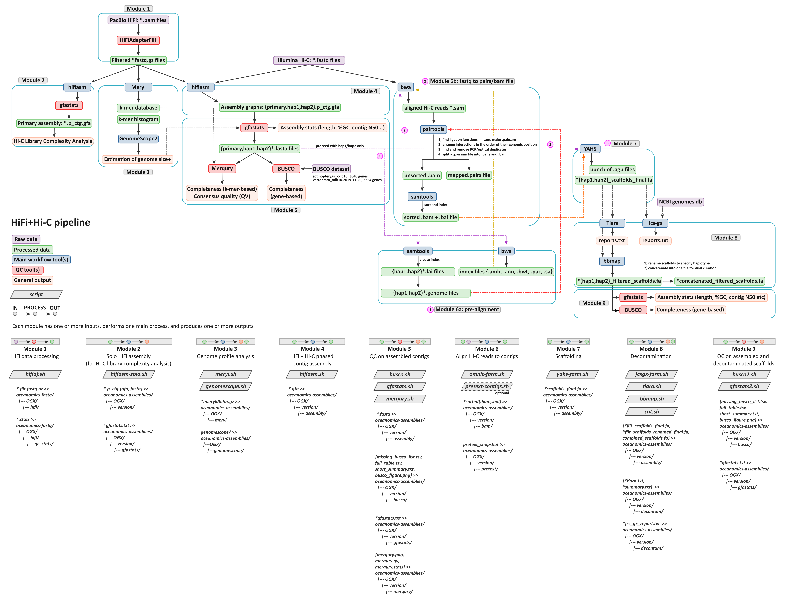

[](https://www.nextflow.io/)
[](https://docs.conda.io/en/latest/)
[](https://www.docker.com/)
[](https://sylabs.io/docs/)
[](https://tower.nf/launch?pipeline=https://github.com/Computational-Biology-OceanOmics/OceanGenomes-refgenomes)

## Introduction

**Computational-Biology-OceanOmics/OceanGenomes-refgenomes** is OceanGenome's reference genome assembly pipeline that combines both hifi and hi-C input data.

<p align="center">
    
</p>

1. Filter and convert bam files to fastq filesc([`HiFiAdapterFilt`](https://github.com/sheinasim/HiFiAdapterFilt))
2. PacBio Read QC ([`FastQC`](https://www.bioinformatics.babraham.ac.uk/projects/fastqc/))
3. Count k-mers ([`Meryl`](https://github.com/marbl/meryl))
4. Estimate genome size ([`GenomeScope2`](https://github.com/schatzlab/genomescope))
5. Illumina Read QC ([`FastQC`](https://www.bioinformatics.babraham.ac.uk/projects/fastqc/))
6. Assemble Pacbio & Illumina reads ([`Hifiasm`](https://github.com/chhylp123/hifiasm))
7. Assembly stats ([`Gfastats`](https://github.com/vgl-hub/gfastats))
8. Gene assembly QC ([`BUSCO`](https://busco.ezlab.org/))
9. K-mer assembly QC ([`Merqury`](https://github.com/marbl/merqury))
10. Create index ([`Samtools`](https://www.htslib.org/))
11. Index assemble and align Hi-C reads ([`BWA`](https://github.com/lh3/bwa))
12. Map pairs ([`Pairtools`](https://pairtools.readthedocs.io/en/latest/))
13. Sort and index ([`Samtools`](https://www.htslib.org/))
14. Create scaffold ([`YAHS`](https://github.com/c-zhou/yahs))
15. Create report ([`fcs-gx`](https://github.com/ncbi/fcs-gx))
16. Create report ([`Tiara`](https://github.com/ibe-uw/tiara))
17. Filter scaffolds ([`BBMap`](https://jgi.doe.gov/data-and-tools/software-tools/bbtools/bb-tools-user-guide/bbmap-guide/))
18. Scaffold stats ([`Gfastats`](https://github.com/vgl-hub/gfastats))
19. Scaffold QC ([`BUSCO`](https://busco.ezlab.org/))
20. Scaffold QC ([`Merqury`](https://github.com/marbl/merqury))
21. copy files to backup location ([`Rclone`](https://rclone.org/))
22. Present QC for raw reads ([`MultiQC`](http://multiqc.info/))

## Usage

> [!NOTE]
> If you are new to Nextflow, please refer to [this page](https://nf-co.re/docs/usage/installation) on how to set-up Nextflow.

First, prepare a samplesheet with your input data that looks as follows:

`samplesheet.csv`:

```csv
sample,hifi_dir,hic_dir,version,tolid,taxids
OG88,hifi_bams/OG89,hic_fastqs/OG89,1,163129,163129
OG89,hifi_bams/OG89,,1,163129,163129
OG90,hifi_fastqs/OG90,hic_fastqs/OG90,1,163129,163129
```

Each row represents a sample. The hifi_dir column must point to a directory that contains bam files or fastq files. The hic_dir column can point to a directory containing fastq files, however this column can be left blank if there isn't Hi-C data for this sample.

Now, you can run the pipeline using:

```bash
nextflow run Computational-Biology-OceanOmics/OceanGenomes-refgenomes \
   -profile <docker/singularity/.../institute> \
   --input samplesheet.csv \
   --outdir <OUTDIR> \
   --buscodb /path/to/buscodb \
   --gxdb /path/to/gxdb \
   --rclonedest <DESTINATION> \
   --binddir /scratch
```

> [!WARNING]
> Please provide pipeline parameters via the CLI or Nextflow `-params-file` option. Custom config files including those provided by the `-c` Nextflow option can be used to provide any configuration _**except for parameters**_;
> see [docs](https://nf-co.re/usage/configuration#custom-configuration-files).

For more details and further functionality, please refer to the [usage documentation](https://github.com/Computational-Biology-OceanOmics/OceanGenomes-refgenomes/blob/master/docs/usage.md) and the [parameter documentation](https://github.com/Computational-Biology-OceanOmics/OceanGenomes-refgenomes/blob/master/docs/parameters.md).

## Pipeline output

For details about the output files and reports, please refer to the
[output documentation](https://github.com/Computational-Biology-OceanOmics/OceanGenomes-refgenomes/blob/master/docs/output.md).

## Credits

Computational-Biology-OceanOmics/OceanGenomes-refgenomes was originally written by Emma de Jong and was converted to Nextflow by Adam Bennett. This version was built on top of the nf-core template.

## Citations

<!-- TODO nf-core: Add citation for pipeline after first release. Uncomment lines below and update Zenodo doi and badge at the top of this file. -->
<!-- If you use OceanGenomes-refgenomes for your analysis, please cite it using the following doi: [10.5281/zenodo.XXXXXX](https://doi.org/10.5281/zenodo.XXXXXX) -->

An extensive list of references for the tools used by the pipeline can be found in the [`CITATIONS.md`](CITATIONS.md) file.

You can cite the `nf-core` publication as follows:

> **The nf-core framework for community-curated bioinformatics pipelines.**
>
> Philip Ewels, Alexander Peltzer, Sven Fillinger, Harshil Patel, Johannes Alneberg, Andreas Wilm, Maxime Ulysse Garcia, Paolo Di Tommaso & Sven Nahnsen.
>
> _Nat Biotechnol._ 2020 Feb 13. doi: [10.1038/s41587-020-0439-x](https://dx.doi.org/10.1038/s41587-020-0439-x).
